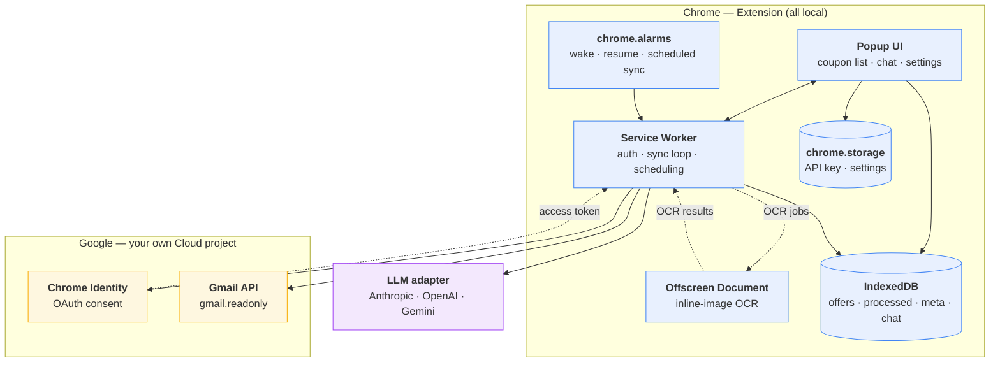
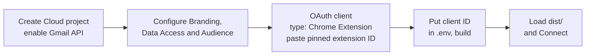
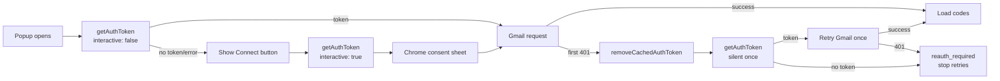
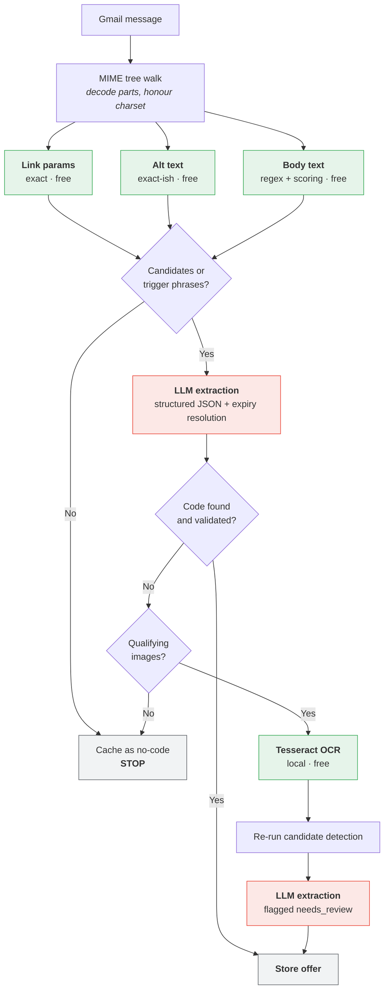
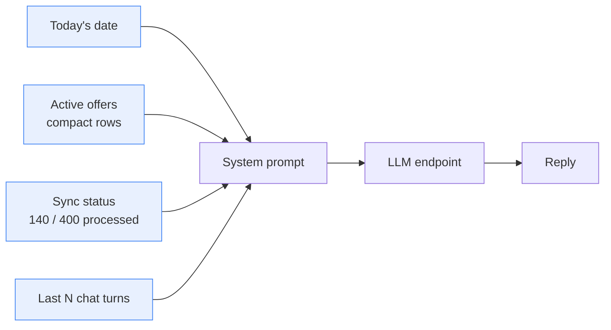

# Inbox Coupon Assistant — Design Doc

A self-hosted Chrome extension that reads your Gmail Promotions category,
extracts coupon codes into structured records, and lets you ask for them in a
chat window instead of scrolling through promotional email.

**Local-first. No app backend, hosted service or project telemetry.** You supply
your own Google OAuth client and LLM API key. Data leaves the extension only for
Gmail API calls and the email excerpts sent to the LLM provider you select.

### Agreed development scope

- Chrome only, with one Gmail account.
- TypeScript in application code and tests, built with Vite; generated
  JavaScript exists only in `dist/`.
- Chat is part of the first usable release, after the coupon list works.
- Supported LLM providers: Anthropic, OpenAI and Google Gemini. Other providers
  and local/custom endpoints are deferred.
- Multiple currencies are supported.
- Sending the email text needed for extraction to the selected cloud LLM is an
  accepted tradeoff and must be stated clearly in settings.
- Weekly Google reconnection while the OAuth project remains in Testing is
  acceptable.

---

## 1. Why self-hosting makes this easy

Distributing a Gmail-reading extension on the Chrome Web Store is genuinely
hard: Google requires a CASA security assessment by an approved lab for
restricted scopes, re-validated every 12 months, typically $540–$1,000 for the
self-serve tier and far more for higher tiers. Until you pass it you're capped
at ~100 users, each manually added to a test-user list.

Self-hosting avoids the distribution and verification work for this personal
use case. Create your own Google Cloud project, add your own address as the only
test user, and leave the app in Testing status.

There is one important limitation: because `gmail.readonly` is not a basic
identity scope, a Testing authorization expires after seven days. The extension
must treat this as a normal disconnected state and show the Connect button
again. Weekly reconnection is acceptable for this project. See Google's
[OAuth documentation](https://developers.google.com/identity/protocols/oauth2#expiration).

---

## 2. Architecture



### Why this split

| Component | Runs where | Owns | Constraint driving the choice |
|---|---|---|---|
| Popup UI | Popup page | Chat, list, settings | Dies on close — holds no durable state |
| Service Worker | Background | Auth, Gmail sync, DB writes | Killed aggressively by MV3; keep it thin |
| Offscreen Document | Hidden page | Inline-image OCR only | Added in phase 7 so bundled Tesseract can spawn its worker without complicating the core parser |
| IndexedDB | Browser | Offers, cache state, chat history | Everything stays on disk, locally |
| `chrome.storage.local` | Browser | API key, model choice, settings | Survives restarts; editable without a rebuild |

---

## 3. Configuration

**There is no `process.env` in a browser extension, and `manifest.json` cannot
read variables at all.** So configuration splits two ways.

### Build-time — the OAuth client ID

It has to end up literally inside `manifest.json`. Either template it with a
small build step, or edit the file by hand.

```
.env.example        → committed
.env                → gitignored
manifest.template.json → committed, contains ${GOOGLE_CLIENT_ID}
```

Use vanilla TypeScript with Vite as the build system. Vite does not imply React
or another UI framework; the popup and settings UI remain plain HTML, CSS and
TypeScript. A small `vite.config.ts` owns the popup, service worker and settings
entry points, copies static assets, and emits `dist/manifest.json` from the
template. The offscreen entry point is added in phase 7 alongside OCR.

Use a tiny local Vite plugin inside `vite.config.ts` to load
`GOOGLE_CLIENT_ID`, validate that it exists, substitute it into the manifest,
and emit the generated JSON. Do not expose LLM API keys through Vite environment
variables; those remain runtime values in `chrome.storage.local`. The OAuth
client ID is not a secret, but keeping manifest generation in the config avoids
making all environment variables available to browser code.

Transpilation and minification are separate operations. Use two modes:

| Command | Output |
|---|---|
| `npm run dev` | `vite build --watch --mode development`: readable JavaScript, source maps, no minification |
| `npm run build` | `vite build`: production bundle with `build.minify: true` and no source maps in `dist/` |

`--mode development` only selects Vite's mode and environment files; it does
not change build optimization defaults. `vite.config.ts` must branch explicitly:

```ts
export default defineConfig(({ mode }) => {
  const development = mode === 'development'

  return {
    build: {
      target: 'chrome120',
      minify: !development,
      sourcemap: development,
      modulePreload: false,
    },
  }
})
```

The production output is therefore already minified JavaScript and does not
need a second minifier. Keep development output readable so Chrome DevTools
errors can be traced back to TypeScript.

Vite transforms TypeScript but does **not** replace strict type-checking. Run
`tsc --noEmit` separately. The small development tool set is `typescript`,
`vite`, `@types/chrome`, `@types/node`, and `tsx`.

The minimum `tsconfig.json` compiler options are:

```json
{
  "compilerOptions": {
    "target": "ES2022",
    "module": "ESNext",
    "moduleResolution": "Bundler",
    "strict": true,
    "noEmit": true,
    "types": ["chrome", "node"]
  }
}
```

Pin the toolchain contract in `package.json` with
`"engines": { "node": ">=22.12.0" }`, use Node 24 in `.nvmrc`, and commit the npm
lockfile. The quoted test glob needs Node 22.6+, while Vite 8 requires Node
22.12+; the higher constraint is therefore the project minimum.

Use Vite's build watch rather than the normal web dev server for the first
version. Chrome loads the unpacked `dist/` directory, and extension service
workers and CSP rules do not behave like an ordinary web page served from
localhost. Add an extension-specific Vite plugin only if manual extension
reloads become a demonstrated development bottleneck.

### MV3 and Vite output contract

Vite emits ES modules. The manifest must register the service worker as a
module using its stable emitted filename:

```json
"background": {
  "service_worker": "assets/background.js",
  "type": "module"
}
```

The manifest contains literal paths and cannot discover Vite's build manifest
at runtime. Configure stable names for the background entry and extension HTML
pages; hashed names are fine for shared chunks imported by those entries. Keep
service-worker imports static because Chrome extension service workers do not
support dynamic `import()`. Target Chrome 120 and disable Vite's module-preload
polyfill because the MVP is Chrome-only and extension pages do not need it.

Phase 1 requests only the core `"identity"` and `"storage"` permissions. Phase
6 adds `"alarms"` when scheduled sync is implemented; the optional
`"offscreen"` permission is added only with phase 7.

### Runtime — the LLM key and model choice

Do **not** bake the API key into the bundle. A built extension is a zip file
anyone can unpack, and a key committed or shared once is a key to rotate.

Put it in a settings page that writes to `chrome.storage.local`:

| Setting | Example |
|---|---|
| `LLM_PROVIDER` | `anthropic` \| `openai` \| `gemini` |
| `LLM_API_KEY` | your own key |
| `LLM_MODEL` | `claude-haiku-4-5-20251001` |
| `BACKFILL_DAYS` | `45` |

Provider base URLs are fixed in code for this version. Custom and local
endpoints can be added later if there is a real need.

---

### Provider adapter

Everything provider-specific lives behind one interface. Three small
implementations, with no provider conditionals elsewhere in the codebase.

```
complete({ system, user, schema, maxTokens })
  → { json, usage: { inputTokens, outputTokens } }
```

| | Anthropic | OpenAI | Gemini |
|---|---|---|---|
| Path | `POST /v1/messages` | `POST /v1/chat/completions` | `POST /v1beta/models/{model}:generateContent` |
| Auth header | `x-api-key: <key>` | `Authorization: Bearer <key>` | `x-goog-api-key: <key>` |
| Required extra header | `anthropic-version: 2023-06-01` | — | — |
| Browser origin | `anthropic-dangerous-direct-browser-access: true` | — | — |
| System prompt | top-level `system` | first message with `role: "developer"` | top-level `systemInstruction` |
| Output limit | `max_tokens` | `max_completion_tokens` where supported | `generationConfig.maxOutputTokens` |
| Reading the reply | `content[]` text/tool blocks | `choices[0].message.content` | `candidates[0].content.parts[]` text blocks |
| Structured output | tool with `input_schema` | strict JSON schema response format | `generationConfig.responseMimeType` plus `responseJsonSchema` |
| Usage fields | `usage.input_tokens` / `output_tokens` | `usage.prompt_tokens` / `completion_tokens` | `usageMetadata.promptTokenCount` / `candidatesTokenCount` |

Use each provider's structured-output mechanism rather than relying only on a
prompt. Anthropic uses a `record_offers` tool with an `input_schema`; OpenAI
uses its strict JSON schema response format; Gemini uses a JSON response MIME
type with a response schema. These mechanisms reduce malformed output, but the
adapter must still parse safely, validate the result against the local schema,
and handle missing content, refusals, network errors and unsupported models.

For the MVP, use Gemini's stateless `generateContent` API for both extraction
and chat. Google recommends the newer Interactions API, but its current official
reference and migration guide disagree on the REST versioned path. This app
already stores chat locally and sends the required context on every turn, so it
does not benefit enough from server-side interaction state to justify that
uncertainty. `generateContent` remains fully supported and has a stable,
documented structured-output contract. Reconsider Interactions only when its
contract is consistent and server-side state is actually wanted. See Google's
[Gemini overview](https://ai.google.dev/gemini-api/docs),
[generateContent reference](https://ai.google.dev/api/generate-content), and
[structured-output guide](https://ai.google.dev/gemini-api/docs/generate-content/structured-output).

Normalise usage fields into the adapter's return value so the local diagnostics
in §7 work identically regardless of provider.

### Provider permissions

```
host_permissions:
  - https://api.anthropic.com/*
  - https://api.openai.com/*
  - https://generativelanguage.googleapis.com/*
```

Keep all LLM calls in the service worker. Requests from an extension context
with the corresponding host permission can make cross-origin requests. The
popup communicates with the service worker for model calls. Only the settings
form handles key entry; existing values stay masked, and only the service worker
reads the stored key when making requests.

### Key storage

`chrome.storage.local` is **plaintext on disk** in the Chrome profile
directory. That's acceptable for a personal project, but:

- Use a key scoped to this project alone, never a shared one.
- Set the strictest available spend or quota limit in the provider console. A
  bounded retry policy is equally important because a retry loop can become
  expensive quickly.
- Never commit `.env`. If a key ever lands in git history, rotate it; scrubbing
  the commit is not the same as the key being unseen.

### Cost, for whoever runs it

Anthropic and OpenAI offer discounted asynchronous batch processing, but its
turnaround defeats the stream-codes-in-during-first-run design. The MVP uses
real-time requests for all three providers.

Prompt caching does help, and applies directly to the offer table sitting in
every chat turn — 90% off cache reads on Anthropic, automatic on OpenAI.

| | |
|---|---|
| Promo emails in 45 days | ~350 |
| Surviving the regex gate | ~140 |
| Tokens per email | ~2.5k in / 200 out |
| **First run — Haiku 4.5** ($1/$5 per MTok) | **~$0.50** |
| **First run — GPT-5.6 Luna** ($0.20/$1.20 per MTok) | **~$0.10** |
| **First run — Gemini** | Depends on the selected Flash model's current rate |
| Ongoing | cents per month |

Rates move; check the provider's current price sheet before budgeting. The
point stands either way — extraction is a simple structured-output task, so the
cheapest tier is genuinely sufficient. A frontier model will not find coupon
codes meaningfully better, and output tokens are the expensive side at roughly
a 1:5 ratio, so keep `max_tokens` tight.

---

## 4. Google Cloud setup

The committed manifest public key already pins the development extension ID, so
create the matching OAuth client before the first authenticated build.



1. Create/select a Google Cloud project and enable the Gmail API.
2. In Google Auth Platform, configure Branding; add `gmail.readonly` under Data
   Access; keep the External audience in Testing and add your Gmail test user.
3. Under Clients, create a **Chrome Extension** client and paste the pinned ID
   printed by `npm run extension-id`.
4. Put the generated client ID in `.env`, build, load `dist/` and Connect.

**Pin the extension ID.** Without a manifest `key`, development IDs may change
when the unpacked extension is loaded from a different checkout. The committed
public manifest key keeps this project's development ID stable. The matching
local `key.pem` is private, gitignored and not used by the unpacked build; it is
needed only to sign a self-hosted CRX with the same signing identity.

Self-hosters cannot reuse anyone else's client ID: it's bound to a specific
extension ID. A Chrome Extension OAuth client is public and uses **no client
secret**. Never put a client secret in the extension, `.env` or source tree.

---

## 5. Authentication



`chrome.identity.getAuthToken` reuses the Google account already signed into
the Chrome profile — no redirect, no new tab, no typing. First run is one click
on a native sheet. Calls remain silent until the Testing authorization expires;
after seven days the UI returns to the disconnected state and asks the user to
connect again.

Do not store a second copy of the token. Chrome Identity already caches access
tokens in memory, so call `getAuthToken({interactive: false})` when a token is
needed. If Gmail returns 401, remove that token with
`removeCachedAuthToken()` and return to the normal reconnect flow.

The MVP is Chrome-only. Edge, Brave and Firefox authentication paths are out of
scope until there is a concrete need.

---

## 6. Gmail sync

| Phase | Call | Notes |
|---|---|---|
| First run | `messages.list`, `labelIds=CATEGORY_PROMOTIONS`, `q=newer_than:45d` | Use the label ID, not a search string — it's the real category |
| Deeper scan | Same with `newer_than:6m`, user-triggered | Opt-in from settings |
| Incremental | `history.list` from stored `historyId` | 404s if the ID is older than ~1 week; fall back to full list |
| Fetch body | `messages.get?format=full` | 20 quota units each under the current Gmail quota table |

The current Gmail limit is 6,000 quota units per user per project per minute;
`messages.get` costs 20 units regardless of response format. Start
conservatively with 5 concurrent message fetches and back off on 429 with
jitter. Raise concurrency only if measured sync time makes it necessary. Recheck
Google's quota table before tuning because these limits have changed over time.

**Why 45 days:** six months of promo mail for a heavy shopper is 1500+ emails;
45 days is 300–400. Roughly a 4× cut in first-run time and cost.

**What it misses:** codes with long or no expiry — welcome and first-order
codes, 90-day vouchers, birthday codes, gift cards. Often the highest-value
ones, and they don't decay. Hence the opt-in deeper scan.

Run sync on a `chrome.alarms` schedule so the popup opens against warm data.
Closing the popup does not cancel a sync: the popup is only a UI client and the
service worker owns the job. Closing Chrome, disabling the extension or putting
the device to sleep pauses work; the persisted job resumes when Chrome can
deliver the next startup or alarm event.

### Operational behaviour

#### Service-worker lifecycle and continuation

Do not promise one continuously running background process. Chrome can stop an
MV3 service worker after inactivity or during unexpectedly long work. Process a
bounded amount of work per wake, checkpoint after every message and create a
one-shot `resume-sync` alarm for the next eligible time whenever work remains.
The normal periodic sync alarm is the fallback. An alarm wakes the worker; a
valid OAuth grant then lets it request a token silently and continue without the
popup being open. A valid token by itself does not keep the worker alive.

If the browser is closed or the device is asleep, no Gmail or LLM work runs in
the meantime. Register `onStartup` and `onInstalled` listeners at module scope;
on either event, ensure the periodic alarm exists and resume pending work from
IndexedDB. Do not assume an alarm survived a browser restart. Do not use
`setInterval`, a keep-alive port or another artificial mechanism to hold the
worker open.

#### Where the alarms live

Chrome owns alarm registrations through `chrome.alarms`; they are not stored in
the popup, an IndexedDB record or a service-worker variable. The generated
manifest grants `"alarms"`, and the module service worker registers all event
listeners synchronously at top level in `src/background/index.ts`:

- `runtime.onInstalled` and `runtime.onStartup` call `ensureSyncAlarm()`;
- `alarms.onAlarm` routes `gmail-sync` and `resume-sync` to the same job runner;
- `runtime.onMessage` lets a user-opened popup request an immediate sync.

Keep the small create/check helpers in `src/background/alarms.ts`. The periodic
registration is conceptually:

```ts
await chrome.alarms.create('gmail-sync', { periodInMinutes: 5 })
```

On startup, call `chrome.alarms.get('gmail-sync')` and recreate it when absent.
For delayed rate-limit or unfinished work, create `resume-sync` with
`{ when: nextAttemptAt }`; replace that one-shot alarm when the required time
changes.

Chrome stores only the wake-up schedule. IndexedDB `meta` remains the source of
truth for `historyId`, pending message IDs, retry count and `nextAttemptAt`.
Therefore an alarm may be safely recreated, delayed or delivered more than once:
the idempotent job runner reads persisted state and decides what work remains.

#### New-email incremental loop

The extension does not receive a JavaScript event for each incoming Gmail
message. In the MVP, create one fixed `gmail-sync` alarm every five minutes and
also request a sync on Chrome startup, after reconnect, and when the popup
opens. Coalesce overlapping requests into the current in-memory sync promise;
there is only one extension service-worker instance, so no distributed lock is
needed.

The five-minute alarm is completely silent: it wakes only the hidden service
worker and must not open the popup, focus a tab, show a notification or otherwise
interrupt the user. Opening the popup is always a user action; when that happens,
the UI reads cached offers immediately and merely asks the worker for a fresh
sync in the background.

Each wake runs this sequence:

1. Coalesce with an in-progress run. If an incremental job is already
   persisted, resume it before doing another history query.
2. Otherwise, read the last committed `historyId` from `meta`.
3. Call `history.list` from that ID for `messageAdded` and relevant
   Promotions-label additions, following all response pages.
4. Deduplicate the returned message IDs and persist them as an incremental job,
   together with the response's new target `historyId`, **before** parsing any
   message.
5. For each pending ID, call `messages.get(format=full)`, confirm that it is a
   Promotions message, run the extraction cascade, then atomically write its
   offer results and `processed` record. Remove that ID from the pending job.
6. Only after every ID is complete or a recorded terminal failure, atomically
   promote the target `historyId` to the committed cursor and clear the job.
7. After the incremental job, process a bounded slice of the older first-run
   backfill. Newly discovered mail therefore does not wait behind hundreds of
   historical messages.
8. If work remains because of rate limiting or a worker time budget, persist
   `nextAttemptAt` and schedule the one-shot `resume-sync` alarm.

The commit order in steps 4–6 is important: advancing `historyId` before the
message IDs finish would allow a service-worker shutdown to skip new mail. If
newer mail arrives while a job is running, it remains after the committed
cursor and is picked up by the following incremental sync. A `404` from
`history.list` follows the routine full-sync fallback described below.

Do not add Gmail push notifications for the MVP. They require a Google Cloud
Pub/Sub topic and subscription lifecycle, while polling is the recommended
client synchronization approach for user-owned browsers and devices.

#### Resumable backfill

Treat the first scan as a persistent job, not one long service-worker task.
Store a small checkpoint in `meta` containing:

```
backfill: {
  status, query, currentPageMessageIds, nextPageToken,
  processedCount, extractorVersion, nextAttemptAt
}
```

Persist the current page of message IDs and its returned `nextPageToken` before
processing that page. Write each message's offers and `processed` record in one
transaction. On extension startup or the next alarm, skip completed IDs and
continue the remaining page. Advance to `nextPageToken` only after every ID in
the current page is terminal. This makes a service-worker shutdown routine and
idempotent rather than a failed sync. If Gmail rejects a saved page token,
restart the same query from page one and let the completion cache skip work.

#### LLM pacing and retries

All extraction calls go through one provider queue. Start with concurrency 1
and conservative spacing between requests; throughput is not an MVP goal.
Interactive chat uses the same limiter but takes priority over queued backfill
work, so a long first scan does not make chat wait behind every email.
Adapt to provider rate-limit headers when present. For `429`, `408` and `5xx`,
honour `Retry-After` or the provider reset time, otherwise use exponential
backoff with jitter. Persist `retryCount` and `nextAttemptAt`, cap retries at
four, and never mark a message processed before extraction succeeds or reaches
a recorded terminal failure. Do not retry authentication, permission, schema,
or invalid-model errors automatically.

Provider limits vary by account tier, model, requests per minute and tokens per
minute, so do not hard-code an assumed tier. A 140-message first run should be
slow and reliable rather than bursty.

Implementation references: [Anthropic rate limits](https://docs.anthropic.com/en/api/rate-limits),
[OpenAI rate limits](https://platform.openai.com/docs/guides/rate-limits), and
[Gemini rate limits](https://ai.google.dev/gemini-api/docs/rate-limits).

#### Authorization-required state

On the first Gmail 401, remove the cached token and try silent authentication
once. If silent authentication fails or the replacement token also gets a 401,
set `meta.authState = "reauth_required"`, stop scheduled sync and stop retrying.
The popup shows Connect; only that user gesture starts interactive auth. After a
successful reconnect, clear the state and resume the persisted backfill. This
covers both seven-day Testing expiry and access revoked in Google Account
settings without creating a retry loop. Chrome may not reliably distinguish
those two causes, so the UI should say "Google access needs reconnecting"
rather than claiming that the token was specifically expired or revoked.

#### Full sync is routine

Testing authorization expires after seven days, while Gmail history IDs are
typically valid for about a week and can expire sooner. If reconnect does not
happen promptly, a 404 from `history.list` and the 45-day full-list fallback are
normal operation, not an exceptional recovery path. The completion cache keeps
that fallback inexpensive by skipping messages already processed with the
current extractor version. Exercise the fallback in tests and store a fresh
`users.getProfile().historyId` after every successful full sync.

---

## 7. Extraction cascade

Cheapest signal first. Every stage can short-circuit the rest.



The OCR branch feeds the **identical prompt and schema** as the text branch.
Only differences: results carry `needs_review` when confidence is low, and
OCR-derived codes are never auto-applied.

### HTML handling without a DOM

Phases 1–3 do not create an offscreen document. Walk the Gmail MIME structure
and use decoded `text/plain` when available. For `text/html`, use small pure
TypeScript scanners over the HTML string to collect:

- `href` values from anchor tags for link-parameter candidates;
- `alt` values from image tags for alt-text candidates; and
- best-effort visible text by removing comments, `script`/`style` blocks and
  tags before normalizing whitespace.

Support single-quoted, double-quoted and unquoted attributes, and decode numeric
plus common named HTML entities before candidate detection. This is deliberately
candidate extraction, not a general-purpose HTML parser or sanitizer. Keep the
functions browser-independent and fixture-tested. If real emails later expose
HTML shapes this cannot handle, improve the scanner from fixtures before adding
DOM infrastructure.

### Stage economics

| Stage | Cost | Expected yield | Why |
|---|---|---|---|
| Link params | Free | **High** | Start with direct coupon parameters and a short allowlist of common redirect keys. Add ESP-specific or double-decoding rules only when real missed emails justify them. |
| Alt text | Free | **Medium-high** | ESPs auto-generate alt from the design layer, so an image banner often carries its own code as text. |
| Body regex | Free | Gate, not answer | Decides whether to spend a token, and gives the LLM a real candidate list to choose from. |
| LLM on text | Paid | **High** | Expiry resolution, min spend, conditions — everything regex can't do. |
| OCR | Free but slow | **Low tail** | Genuinely image-only emails. Costs bundle size and latency, not money. |

Keep lightweight local diagnostics from day one: stage reached, whether a code
was found, and tokens used. This is local debugging data, not telemetry, and it
can be cleared from settings. The yield column is only a hypothesis until it is
measured against the target inbox.

### Tuning order

1. **Blocklist first.** Run the backfill, dump every high-scoring candidate that
   was junk, add those words. Biggest accuracy win for the least work.
2. **Then the gate.** If more than ~40% of emails reach the LLM, the regex is
   too permissive and you're paying for newsletters with no offer in them.
3. **Then OCR thresholds.** If most OCR results land in `needs_review`, the
   preprocessing is inverting the wrong images.

### Regression fixtures

Tunable regexes, scoring weights and blocklists require deterministic tests.
Because production uses `messages.get(format=full)`, keep a small set of
sanitized Gmail message JSON fixtures in that exact response shape, with
expected extraction JSON. Start with roughly 10 messages covering plain text,
multipart HTML, nested MIME, subject codes, alt-text codes, link parameters,
multiple currencies, relative expiry, a false positive and a no-code message.
Remove addresses, order data, tracking URLs and personal codes before committing
a real response. If examples begin as `.eml` files, convert them once into the
Gmail `format=full` fixture shape rather than adding a second production parser.

Run MIME parsing and the free extraction stages against these fixtures without
network access. Keep separate saved provider-response fixtures for adapter
parsing and schema validation; unit tests must not call a live LLM. Every
blocklist or scoring change must keep the fixture suite green and should add the
email shape that motivated the change.

Use Node's built-in `node:test` runner and `node:assert/strict`; do not add Jest
or Vitest. Keep tests in TypeScript and use `tsx` only as the TypeScript runtime
hook for Node, not as a second test framework. The expected scripts are:

```
npm test          # node --import=tsx --test "test/**/*.test.ts"
npm run typecheck # tsc --noEmit
npm run check     # typecheck, then tests
```

Keep MIME decoding, normalization, scoring, deduplication and provider-response
parsing in browser-independent TypeScript modules. The link, alt-text and
visible-text HTML scanners are pure string functions and run against the same
Node fixtures, so no DOM library is needed. Mock only the narrow Gmail,
IndexedDB, Chrome and LLM boundaries.

### Image handling

Reach for OCR only after link params and alt text have failed.

| Source | Tracking impact |
|---|---|
| Inline `cid:` attachments | **None** — served by Google |
| Remote CDN images | **Not fetched in this version** — would register an open |

Read only inline Gmail image parts in this version. They are ranked by declared
size, with template furniture filtered before OCR. Remote image support is
deferred until the product has an explicit, user-visible permission flow.

Preprocessing is what makes Tesseract usable on banners: flatten alpha onto
white, upscale 2–3×, grayscale, Otsu threshold, detect polarity so
light-on-dark text gets inverted. Without it you get `M0NS00N4O` instead of
`MONSOON40`.

Tesseract core and `eng.traineddata` must be **bundled** — MV3 blocks remotely
hosted code at runtime, not just by policy. Budget 12–15MB.

OCR is included in the extraction cascade only after text stages fail, and the
offscreen document is created on demand. Its engine is bundled separately and
closed after each sync slice so it does not retain memory between runs.

Phase 7 adds the `"offscreen"` manifest permission and creates the document
with `chrome.offscreen.Reason.WORKERS` plus a specific justification such as
"Run bundled Tesseract OCR for inline coupon image extraction." Do not request
`DOM_PARSER`: HTML candidate extraction remains browser-independent. Add other
offscreen reasons only if the implemented OCR path actually requires them.

Here, the two worker terms mean different things. The MV3 **service worker** is
the extension's event-driven background coordinator. Tesseract.js
`createWorker()` needs to spawn a separate **dedicated Web Worker** that runs its
CPU-heavy WebAssembly OCR engine, but Chrome does not expose the `Worker`
constructor inside a service-worker context. The service worker therefore sends
an OCR request to a hidden `offscreen.html` document; that document has a normal
`window` environment, creates the Tesseract Web Worker, and sends the recognized
text back through `chrome.runtime` messaging. `Reason.WORKERS` tells Chrome that
spawning this worker is the specific reason the hidden document is required.
Close the offscreen document and terminate the Tesseract worker after the OCR
queue becomes idle so the feature does not retain memory indefinitely.

---

## 8. Expiry handling

Easy to get subtly wrong, so it's called out separately.

| Stage | Responsibility |
|---|---|
| LLM extraction | **Resolve** the date. "Valid till Sunday" / "3 days left" → `2026-09-20`, computed against the email's own date. |
| Storage | Keep active offers and a short grace window of recently expired offers. |
| Read / display | Compare `expiry` to today; hide expired offers from the active list immediately. |
| Cleanup | During the existing scheduled-sync alarm, delete offers whose known `expiry` is more than 30 days old. |

**Do not filter expired offers at write time.** Expiry is a function of when you
ask, not when you extracted. A code with 20 days left gets written as "valid"
and would still read as "valid" next month. Any freshness boolean computed at
write time is stale the moment it's stored.

Keep recently expired records for 30 days so the UI can show "expired 2 days
ago" when useful, then purge them without adding a separate cleanup scheduler.
Offers with `expiry = null` are not automatically deleted in the MVP because
the source did not provide enough information to prove they are expired. The
`processed` record remains after an offer is purged, so a routine full-sync does
not pay to extract the same old message again.

---

## 9. Data model

### Offer record

| Field | Type | Notes |
|---|---|---|
| `code` | string | Exact case as it appears |
| `normalized_code` | string | Uppercased/trimmed form used only for matching and deduplication |
| `brand` | string | Display name from sender; LLM may improve it, but it is never used as identity |
| `sender_domain` | string | Lowercased domain parsed from the RFC 5322 `From` address |
| `brand_key` | string | Deterministic identity derived from `sender_domain`; never from LLM output |
| `discount` | string | `"20%"`, `"₹500"`, `"free shipping"` |
| `currency` | string \| null | ISO 4217 code such as `INR`, `USD` or `EUR`; null for percentage/free-shipping offers with no monetary amount |
| `min_spend` | number \| null | Numeric only; interpreted using `currency` |
| `max_discount` | number \| null | Caps on percentage offers; interpreted using `currency` |
| `expiry` | date \| null | Resolved at extraction, evaluated at read; null when unstated |
| `single_use` | bool \| null | See inference below |
| `new_users_only` | bool | Very common in Indian retail |
| `app_only` | bool | Won't work on web checkout |
| `categories` | string[] | Empty if unrestricted |
| `conditions` | string | One short line |
| `source` | enum | `link` · `text` · `ocr` |
| `needs_review` | bool | Surface as "verify this" in UI |
| `source_message_ids` | string[] | Every Gmail message supporting this deduplicated offer |
| `source_thread_id` | string | Thread ID of the newest source, used to open the email in Gmail |
| `source_sender` | string | Sender of the newest supporting message |
| `source_subject` | string | Subject of the newest supporting message |
| `source_message_date` | timestamp | Gmail internal date of the newest supporting message |

### Brand identity and deduplication

Derive `brand_key` before calling the LLM. Use a Public Suffix List-aware parser
to find the registrable domain, then remove the public suffix:

```
offers.mail.myntra.com  → myntra.com → myntra
deals.example.co.uk     → example.co.uk → example
```

If the sender has no valid domain, fall back to the normalized full sender
address. The LLM may return `Myntra` or `Myntra Fashion` for display in `brand`,
but neither value can change `brand_key`. If one retailer later uses multiple
unrelated registrable domains, add a small evidence-based alias map rather than
asking the model to decide identity.

### Inferring `single_use`

Often **unknowable at extraction time**, so the field is nullable. For the MVP,
set it only when the email contains explicit language such as "exclusive to
you", "non-transferable", "one-time use", or "valid for a single
transaction". Do not build entropy scoring or a learning system yet.

For display, treat `null` as reusable and show an explicit one-time label only
when the source says so. Expired status is derived at read time from `expiry`
and today's date; records with a known expiry are purged after the 30-day grace
window. Used/failed feedback and reminder prompts are deferred until the basic
extraction, list and chat experience has been validated.

### Stores

| Store | Key | Purpose |
|---|---|---|
| `offers` | `[brand_key, normalized_code]` | One displayed offer with all supporting message IDs; indexes on brand, expiry and code |
| `processed` | `messageId` | Completion record for positive, negative and terminal-failure results; prevents repeated work |
| `meta` | `key` | `historyId`, auth state, backfill checkpoint, last sync and extractor version |
| `chat` | `turnId` | Last N conversation turns |

Version the extractor. When prompts or heuristics change, bump it so
older-version cache entries become eligible for reprocessing.

---

## 10. Chat

**Scope: coupons from the Promotions category only.** Not order tracking, not
receipts, not general inbox questions.

### Don't build RAG

The instinct is to embed emails and do semantic search. Skip it.

After extraction you have a **small structured table** — typically 50–200 live
offers. Serialise the whole active set as compact rows straight into the system
prompt. That's 5–15k tokens, affordable per message.

Why this beats retrieval:

- No retrieval step means no retrieval failures.
- The model sees every offer at once, so it can reason across them: "which of
  these stacks with the sale already running", "cheapest way to clear the ₹2000
  minimum".
- Hallucinated codes can be caught cheaply by validating every code or offer ID
  in the response against this complete list before displaying it.

Only past a few hundred active offers do you need pre-filtering — and then it's
a brand/category filter, not vector search.

### Context assembly per message



Today's date must be injected explicitly — the model can't otherwise evaluate
`expiry`.

### Hedging during first sync

Progress bar shows, but chat stays usable throughout. The trap: you ask "do I
have a Myntra code?" at 30% sync, the Myntra email hasn't been processed, and
chat confidently says no.

Give chat the sync state and instruct it to qualify **negatives only** during
backfill:

> Nothing from Myntra in the 140 emails I've read so far — still working
> through 260 more.

Positives can be stated flatly. Only absence needs the caveat.

### Chat rules

- Ask the model for structured `{ answer, offer_ids }` output. `answer` must not
  contain coupon codes; the UI renders code cards from validated `offer_ids`
  using IndexedDB values, never model-produced code strings.
- Instruct the model never to output a code that is not in the provided rows,
  then enforce the rule in code before rendering the reply.
- Always surface `min_spend`, `expiry` and blocking conditions
  (`new_users_only`, `app_only`) alongside a code — a code you can't actually
  use is worse than no answer.
- Mark `needs_review` codes as unverified.
- Persist the last N turns so closing the popup doesn't lose the thread.

---

## 11. Trust rules

A wrong code that fails at checkout is worse than a missing one.

1. **Never let the model invent a code.** Hand it the regex candidates and
   link-derived codes, then reject any returned string absent from the source.
2. **Retain source and confidence.** Link- and text-derived codes still require
   source validation. OCR-derived codes always carry `needs_review`.
3. **Refuse to guess on OCR.** Low per-word confidence or confusable glyphs
   (O/0, I/1, S/5, B/8) → `needs_review`, and show "couldn't read confidently —
   open email" rather than a code.

---

## 12. Security notes

Self-hosting removes the need to operate an application backend, but it does
not make the cloud LLM local: the selected provider receives the email excerpts
needed for extraction and chat. Send only the minimum relevant text, disclose
this clearly in settings, and rely on the user's own provider account and key.
The remaining security issues still apply.

### Prompt injection

Promotional emails are attacker-writable text flowing into your prompts — both
extraction and chat. Marketing email is one of the most adversarial text
sources there is.

- Tell the model explicitly that email content is untrusted data to extract
  from, never instructions to follow.
- Reject any code not present in the source, so an injected code can't
  materialise from nothing.

**Residual gap, stated plainly:** this stops *invented* codes. It does not stop
a malicious email from planting a real attacker-controlled string in its own
body and having it extracted as a legitimate offer. Acceptable while you only
display codes. Not acceptable if you add auto-apply at checkout.

### Request hygiene

- Do not fetch retailer CDNs. OCR reads only Gmail-provided inline image parts,
  so the extension does not register opens with senders or request blanket host
  access.
- Never commit `.env`. Rotate the key if it ever lands in git history; scrubbing
  a commit is not the same as the key being unseen.

---

## 13. Build order

| Phase | Scope | Exit criteria |
|---|---|---|
| **1. Skeleton** | Node version pin, strict TypeScript setup, Vite development/production builds, MV3 module manifest generation, OAuth, Gmail list and popup showing subjects | Node 22.12+ is enforced; type-check passes; development source maps work; production output is minified; module service worker registers from its fixed path; extension ID is pinned; revoked/expired auth reaches `reauth_required` without looping |
| **2. Storage + free extraction** | Minimal IndexedDB stores, resumable backfill checkpoint, completion cache, MIME walk, pure TypeScript HTML candidate scanners and sanitized fixtures | Killing/restarting the service worker resumes the current page; subject/body/link/alt fixtures pass in Node without DOM infrastructure; completed messages are not reprocessed |
| **3. Coupon list** | Deduplication, expiry-at-read, currency display, source-email link | Stored offers are traceable, searchable and usable without chat |
| **4. LLM layer** | Settings plus Anthropic, OpenAI and Gemini adapters; structured extraction, local validation and a persistent rate-limited queue | Expiry, currency and conditions populate correctly; a full backfill completes under low-tier limits without an unbounded retry loop |
| **5. Chat** | Context assembly, response validation, sync-state hedging and short history | "What works on Myntra over ₹2000" answers correctly without emitting an unknown code |
| **6. Scheduled sync** | Alarms, bounded background work, persisted Gmail 429 backoff, Gmail history sync, routine full-sync fallback and the expired-offer sweep | Closing the popup does not interrupt the persisted job; rate-limited work and worker termination/browser restart resume safely; both incremental and expired-history paths produce the same stored offers; offers more than 30 days past a known expiry are purged |
| **7. OCR** *(optional)* | `offscreen` permission, WORKERS justification, offscreen-document lifecycle, Tesseract and preprocessing | Build only if local diagnostics show a meaningful number of missed image-only coupons |

Phases 1–3 need no LLM key at all — link params and alt text are pure parsing.
That's a satisfying amount of working product before you configure anything.

---

## 14. Repo checklist

- `README.md` — current step-by-step Google Cloud setup from §4
- `.env.example` — client ID placeholder, nothing real
- `.gitignore` — `.env`, `dist/`, `node_modules/`
- `.nvmrc` — Node 24 for local development
- `package.json` — scripts, `engines.node >=22.12.0`, and development dependencies
- `package-lock.json` — committed for repeatable installs
- `tsconfig.json` — strict, no emit, `moduleResolution: "Bundler"`, and explicit Chrome/Node types; Vite owns JavaScript generation
- `vite.config.ts` — extension entry points, Chrome 120 target, fixed manifest-referenced output names, `modulePreload: false`, manifest generation, mode-dependent source maps and production minification
- `manifest.template.json` — committed; `dist/manifest.json` generated
- `src/background/index.ts` — top-level MV3 event listeners and job-runner entry
- `src/background/alarms.ts` — create/check the periodic and one-shot alarms
- `src/types/` — shared TypeScript-only contracts, with no runtime utilities
- `src/utils/` — reusable runtime functions, with no shared type contracts
- `src/llm/` — adapter interface plus `anthropic.ts`, `openai.ts` and `gemini.ts`
- `test/fixtures/emails/` — sanitized Gmail `format=full` JSON and expected extraction JSON
- `test/fixtures/providers/` — saved success, refusal, malformed and rate-limit responses
- Settings page — provider, key and model, plus a clear notice that relevant
  email text is sent to the selected provider
- Permissive license (MIT or Apache-2.0) since store-clone risk no longer applies
- OCR vendor files in their own directory, documented as local inline-image OCR

---

## 15. Out of scope

- **Code validation** — knowing a code exists isn't knowing it works. Verifying
  means hitting retailer cart APIs, a much thornier problem.
- **Public web-code fallback** — when there's no personal code for a brand, say
  so rather than scraping RetailMeNot.
- **Auto-apply at checkout** — the most useful feature and the one that turns
  prompt injection from cosmetic into dangerous. Revisit §12 first.
- **Non-English OCR** — Hindi/Devanagari banners need `hin.traineddata` and
  roughly double the bundle.
- **PDF voucher attachments** — some brands send these.
- **Outlook and other providers** — Microsoft Graph is a separate auth path
  entirely.
- **Other browsers and multiple Gmail accounts** — the MVP is Chrome-only and
  uses the single account selected by Chrome Identity.
- **Other LLM providers and custom/local endpoints** — Anthropic, OpenAI and
  Gemini are the complete provider list for the MVP.
- **Used/failed learning and reminder prompts** — add them only after the core
  list and chat workflow is useful.
