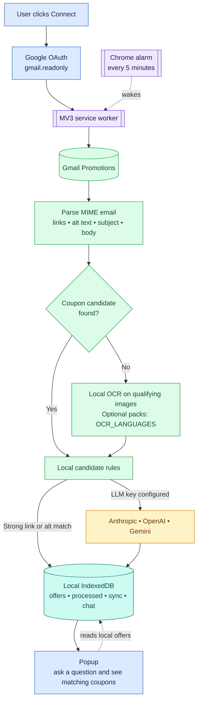

# Inbox Coupon Assistant

A self-hosted Chrome extension that finds coupons in Gmail Promotions and keeps
them in a local, searchable list. There is no app backend, analytics, or hosted
database. You connect your own Google account and optionally add your own LLM
provider key.

For the complete technical plan, see [COUPON-EXTENSION-DESIGN.md](COUPON-EXTENSION-DESIGN.md).

## How it works



The popup is only a view. Closing it does not stop a scan. The service worker
continues through Chrome alarms and uses a saved cursor to pick up new Gmail
messages without reprocessing everything.

## Local data

All data is stored in Chrome under this extension's own origin:

| Location | Stores |
|---|---|
| IndexedDB | `offers` (deduplicated coupons), `processed` (message IDs and extraction results), `meta` (sync cursor/retries), `chat` (latest 20 turns) |
| `chrome.storage.local` | provider, model, and your API key |

Raw email bodies and downloaded image files are not stored. OCR text and coupon
candidates may be stored with the processed-message record so the same email is
not scanned again. Google manages the OAuth token cache. If you add an LLM key,
relevant extraction text and chat questions go directly to that provider.

## Setup

### 1. Get a Google client ID

This development build has a fixed extension ID:

```text
bjbhbbododfldjjknhanpohghijlgpcc
```

1. In [Google Cloud Console](https://console.cloud.google.com/), create a project.
2. Enable **Gmail API**.
3. In **Google Auth Platform**, add app branding and the scope below under
   **Data Access**:

   ```text
   https://www.googleapis.com/auth/gmail.readonly
   ```

4. Under **Audience**, keep it in **Testing** and add your Gmail address as a
   **Test user**.
5. Under **Clients**, choose **Create client → Chrome Extension** and paste the
   extension ID above into **Item ID**.
6. Copy the resulting client ID into `.env`:

   ```dotenv
   GOOGLE_CLIENT_ID=your-client-id.apps.googleusercontent.com
   ```

Use the **Chrome Extension** client type. There is no client secret for this
extension.

### 2. Optional: add OCR languages

English is bundled by default. Add extra Tesseract language packs only if your
Promotions emails need them:

```dotenv
OCR_LANGUAGES=eng,hin,fra
```

Each added language increases the extension size. Codes come from
[tessdata_fast](https://github.com/tesseract-ocr/tessdata_fast).

### 3. Build and load

```bash
npm install
npm run build
```

In Chrome, open `chrome://extensions`, enable **Developer mode**, choose **Load
unpacked**, and select `dist/`. Open the extension and click **Connect Google**.
Add an Anthropic, OpenAI, or Gemini key from the Settings gear only if you want
LLM validation and chat.

## Keep private

Keep your development `GOOGLE_CLIENT_ID` in the gitignored `.env` file. A client
ID alone cannot read your Gmail: the user must still sign in and grant consent.
But a copied unpacked extension could reuse a committed ID and present your
OAuth project's consent screen, consuming its quota or harming its reputation.

Never commit an LLM API key, OAuth token, client secret, or `key.pem`. A
published Chrome extension will expose its production client ID in its manifest;
that is normal, but use a separate, production Google Cloud project for it.

## Development

| Command | Purpose |
|---|---|
| `npm run dev` | Watch build with source maps |
| `npm run build` | Production build |
| `npm run check` | Type-check and run tests |

Requirements: Node 22.12+, Chrome 120+, a Google account, and a Google Cloud
project.
